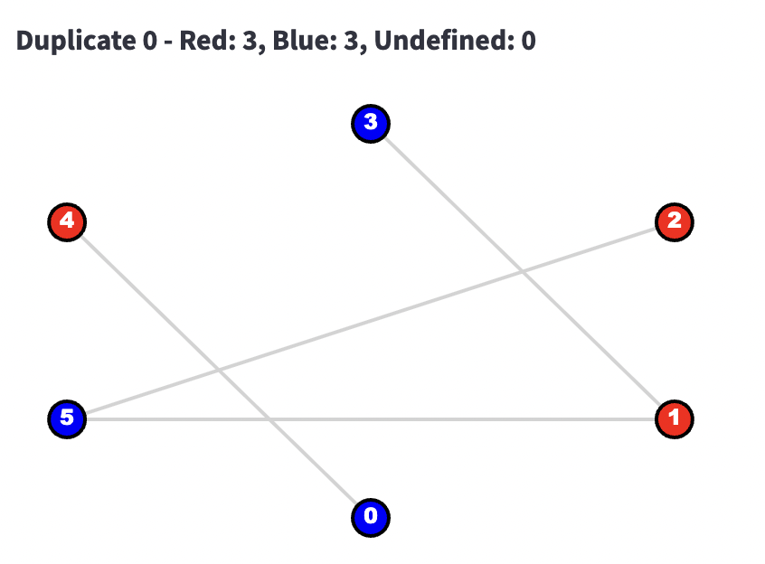
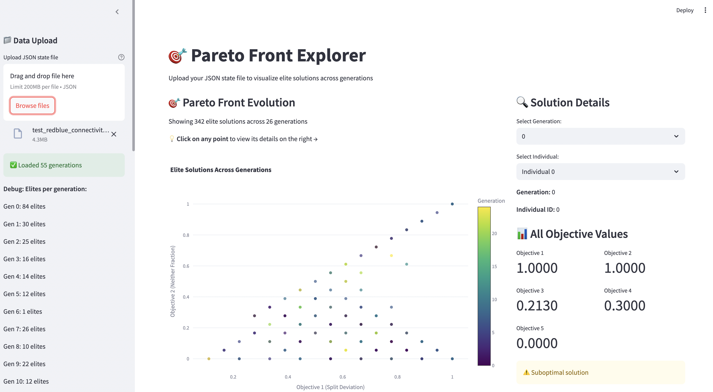

# Social Simulation Framework

A powerful Python framework for creating and running multi-agent social simulations using Large Language Models (LLMs). This framework enables researchers and developers to model complex social interactions, game theory scenarios, and emergent behaviors through AI-powered agents.

## 🚀 Features

- **LLM-Powered Agents**: Agents that use OpenAI GPT or Anthropic Claude for decision-making and communication
- **Multi-Agent Simulations**: Support for complex multi-agent environments with configurable connectivity graphs
- **Game Theory Support**: Built-in support for classic games like Prisoner's Dilemma and custom scenarios
- **Experiment Framework**: Run multiple simulations with statistical analysis and outcome tracking
- **Genetic Evolution**: Evolve agent behaviors over multiple generations
- **Time-Aware Agents**: Agents that can reason about different time scales (hours, days, weeks, months, years)
- **Visualization Tools**: Generate plots and visualizations of simulation results
- **Batch Processing**: Efficient batch processing of agent decisions for better performance
- **Flexible Configuration**: JSON-based configuration for easy experiment setup

## 📊 Visualizations

The framework generates rich visualizations to help understand simulation dynamics:

### Network Graph Visualization


### Simulation Results


## 📦 Installation

### Prerequisites
- Python 3.8+
- OpenAI API key (for GPT models) or Anthropic API key (for Claude models)

### Setup

1. **Clone the repository:**
```bash
git clone https://github.com/schenkmanjack/social_sim.git
cd social_sim
```

2. **Install dependencies:**
```bash
pip install -r requirements.txt
```

3. **Install the packages in development mode:**
```bash
pip install -e ./social_sim
pip install -e ./social_gym
```

4. **Set up environment variables:**
```bash
export OPENAI_API_KEY="your-openai-api-key"
# or
export ANTHROPIC_API_KEY="your-anthropic-api-key"
```

### Using Conda Environment

Alternatively, you can use the provided environment.yaml:

```bash
conda env create -f social_sim/environment.yaml
conda activate social_sim
```

## 🎮 Quick Start

### Basic Simulation

```python
from social_sim import Simulation
from social_sim.llm_interfaces import OpenAIBackend
import os

# Initialize LLM backend
llm = OpenAIBackend(api_key=os.getenv('OPENAI_API_KEY'))

# Create simulation
simulation = Simulation(llm)

# Run a prisoner's dilemma simulation
query = "Two agents playing prisoner's dilemma repeatedly"
results = list(simulation.run(query=query, steps=5))

print("Simulation completed!")
```

### Running from Command Line

```bash
# Run a basic simulation
python social_sim/example/run_sim.py --query "Agents negotiating a trade deal" --steps 10

# Run an experiment with multiple simulations
python social_sim/example/run_experiment.py config.json

# Run genetic evolution
python social_sim/example/run_evolution.py evolution_config.json
```

### Manual Configuration

For more control, use manual configuration:

```python
from social_sim import Simulation
from social_sim.llm_interfaces import OpenAIBackend

# Load from JSON configuration
simulation = Simulation(llm)
simulation.setup_from_config({
    "name": "Red vs Blue",
    "agents": [
        {
            "id": "agent_0",
            "prompt": "You identify as red team..."
        },
        {
            "id": "agent_1", 
            "prompt": "You identify as blue team..."
        }
    ],
    "connectivity": {
        "agent_0": {"neighbors": ["agent_1"], "visible_facts": []},
        "agent_1": {"neighbors": ["agent_0"], "visible_facts": []}
    }
})

# Run manual simulation
results = list(simulation.run_manual(steps=5))
```

## 🏗️ Project Structure

```
social_sim/
├── assets/                     # Visualization assets
│   ├── graph.png              # Network graph visualizations
│   └── visualiation_1.png     # Simulation result plots
├── social_sim/                # Core simulation package
│   ├── agents/                # Agent implementations
│   ├── experiment/            # Experiment framework
│   ├── interactions/          # Environment and connectivity
│   ├── llm_interfaces/        # LLM backend interfaces
│   ├── orchestrator/          # Simulation orchestration
│   └── simulation/            # Main simulation engine
├── social_gym/                # Optimization and performance tools
├── example/                   # Example scripts and configurations
│   ├── run_sim.py            # Single simulation runner
│   ├── run_experiment.py     # Multi-simulation experiments
│   └── run_evolution.py      # Genetic evolution runner
└── requirements.txt          # Python dependencies
```

## 🔧 Configuration

### Agent Types

- **Regular Agents**: Basic LLM-powered decision making
- **Timescale-Aware Agents**: Can reason about different time horizons

### Supported LLM Backends

- OpenAI GPT models (GPT-3.5, GPT-4)
- Anthropic Claude models
- Extensible interface for custom backends

### Environment Features

- **Dynamic Environment**: Environment state changes based on agent actions
- **Connectivity Graphs**: Define which agents can communicate with each other
- **Visible Facts**: Control what information each agent can observe
- **Message Passing**: Agents can send messages to their neighbors

## 📈 Experiment Types

### 1. Basic Simulations
Single-run simulations for exploring specific scenarios.

### 2. Multi-Run Experiments  
Statistical analysis across multiple simulation runs with outcome tracking.

### 3. Genetic Evolution
Evolve agent behaviors across generations using genetic algorithms.

### 4. Batch Processing
Efficient processing of multiple agents using batched LLM calls.

## 🎯 Use Cases

- **Game Theory Research**: Model classic games like Prisoner's Dilemma, Ultimatum Game
- **Social Psychology**: Study cooperation, competition, and group dynamics  
- **Economics**: Model market behaviors, negotiations, and resource allocation
- **Political Science**: Simulate voting, coalition formation, and policy debates
- **Organizational Behavior**: Model team dynamics and decision-making processes
- **AI Safety Research**: Study emergent behaviors in multi-agent systems

## 🤝 Contributing

1. Fork the repository
2. Create a feature branch (`git checkout -b feature/amazing-feature`)
3. Commit your changes (`git commit -m 'Add amazing feature'`)
4. Push to the branch (`git push origin feature/amazing-feature`)
5. Open a Pull Request

## 📄 License

This project is licensed under the MIT License - see the LICENSE file for details.

## 📚 Documentation

For more detailed documentation and examples, see:
- `/example/` directory for usage examples
- `/social_sim/` source code with inline documentation
- Configuration examples in JSON format

## ⚡ Performance Tips

- Use batch processing for multiple agents (`use_batched=True`)
- Adjust `chunk_size` for memory management in long simulations
- Consider `disable_summary=True` for faster runs without detailed summaries
- Use environment variables for API keys instead of hardcoding

## 🐛 Troubleshooting

**API Rate Limits**: The framework includes automatic retry logic and rate limiting.

**Memory Issues**: Reduce `chunk_size` or enable summary disabling for large simulations.

**Agent Errors**: Check agent prompts and ensure they provide clear instructions for decision-making.

---

*Built with ❤️ for social simulation research* 